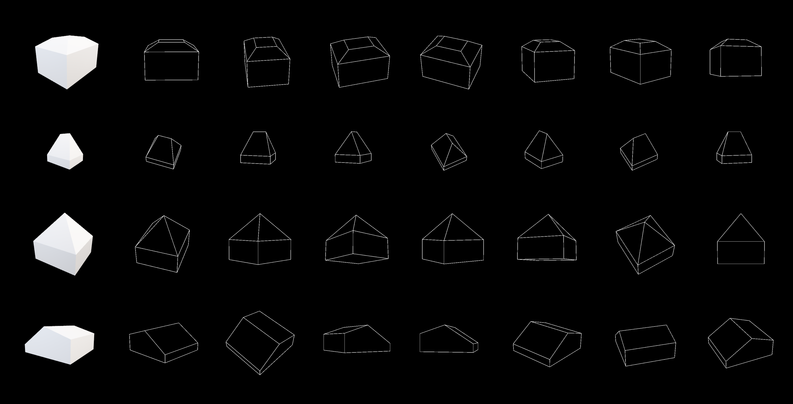
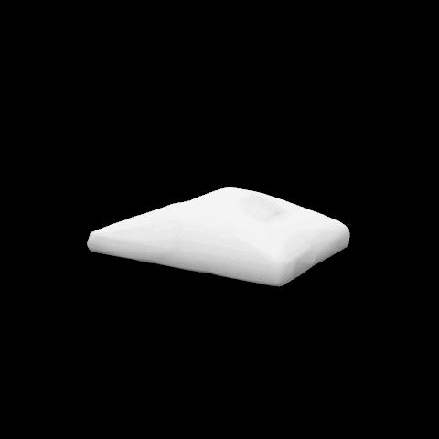
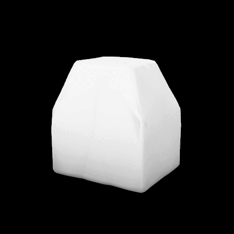
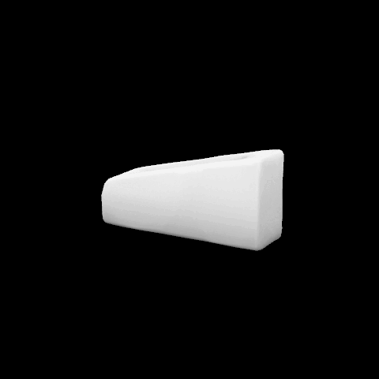
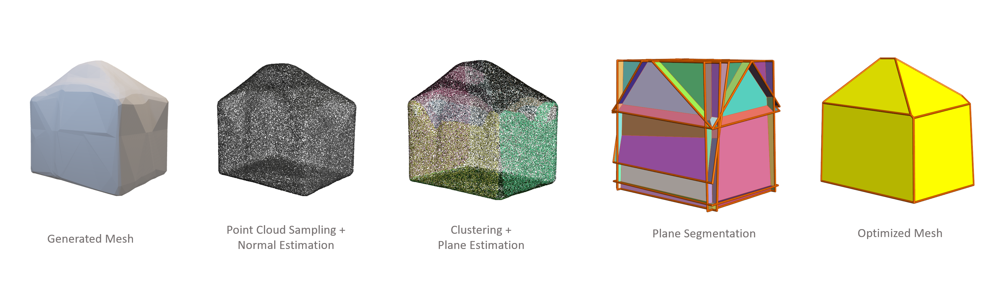
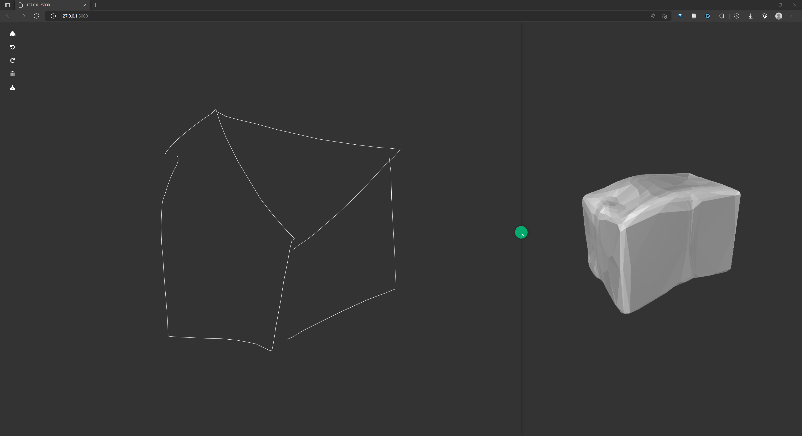

# Architectural Sketch To 3D Printing
Take a single architectural sketch as input and generate a ready-to-print 3D model.

## Dataset Preparation
### Simple House Dataset Generator

- `simple_house_generator.gh`: A grasshopper script for generating the "Simple House" dataset. After running this script, you can use `postprocess_sketch.py` and `gen_voxel_from_obj.py` to convert the sketch into the same style as the `shapenet-synthetic` dataset from [sketch2model](https://github.com/bennyguo/sketch2model) and generate the corresponding voxel.

### Simple House Dataset

In this project, we proposed the Simple House Dataset. We define 5 categories of houses – distinguished by roof type and other geometric properties – and generated 1000 models for each category with parameters chosen randomly. Each model includes a mesh and 20 perspectival line drawings taken from different angles, where:
-    0 ~ 1000: hip-flat (mansard)
- 1001 ~ 2000: hip
- 2001 ~ 3000: pyramid 
- 3001 ~ 4000: random roof (including M-shape, butterfly, gambrel)
- 4000 ~ 5000: random shape


The dataset can be downloaded from [TBD](./).

## Mesh Generation
Here's a demostration of the mesh deformation approach.
| Hip | Mansard | flat |
| --- | ------- | ---- |
|  |  | 


## Mesh Optimization
[PolyFit](https://3d.bk.tudelft.nl/liangliang/publications/2017/polyfit/polyfit.html) is used here to perform the mesh optimization.


## Demo Website
A demo website can be found in `/demo`. You can launch the sever with:
```bash
cd demo
bash ./run_flask.sh
```



### Utilities scripts
- `angle_evaluation.py`: A grasshopper script which takes azimuth and elevation as input and orient Rhino's view.
- `object_baker.gh`: Dynamically bake a object generated from grasshopper script.
- `photo_taker_single_obj.gh`: A grasshopper script that can take photo of 3D model in specific angle.

## References
1. Building Dataset Generator: https://github.com/CDInstitute/Building-Dataset-Generator
2. sketch2model: https://github.com/bennyguo/sketch2model