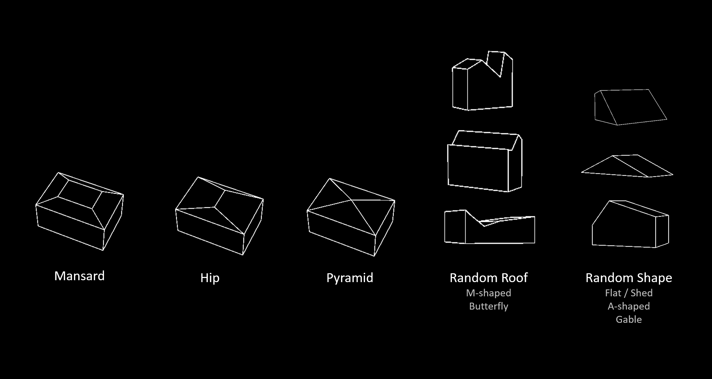

# Architectural Sketch To 3D Printing
Take a single architectural sketch as input and generate a ready-to-print 3D model.

## Dataset Preparation
### Simple House Dataset Generator

- `simple_house_generator.py`: A grasshopper script for generating the "Simple House" dataset, which the structure is similiar to the `shapenet-synthetic` dataset from [sketch2model](https://github.com/bennyguo/sketch2model).

### Simple House v2

We define 5 categories of houses – distinguished by roof type and other geometric properties – and generated 1000 models for each category with parameters chosen randomly. Each model includes a mesh and 20 perspectival line drawings taken from different angles, where:
-    0 ~ 1000: hip-flat (mansard)
- 1001 ~ 2000: hip
- 2001 ~ 3000: pyramid 
- 3001 ~ 4000: random roof (including M-shape, butterfly, gambrel)
- 4000 ~ 5000: random shape

### Post processing
- `obj2sketch.py`: A grasshopper script for generating rendered image of the 3d model generated by the [Building-Dataset-Generator](https://github.com/CDInstitute/Building-Dataset-Generator)
- `obj2voxel.py`: Convert generated .obj file to voxel, which has the same structure as `shapenet-synthetic` dataset.
- `postprocess_sketch.py`: Process the sketch exported by Rhino into the form of sketch in `shapenet-synthetic` dataset.
- `voxel_test.py`: Visualizer for `voxel.mat`

## Mesh Generation
Here's a demostration of the mesh deformation approach.
| Hip | Mansard | flat |
| --- | ------- | ---- |
|  |  | 

## Mesh Optimization
[PolyFit](https://3d.bk.tudelft.nl/liangliang/publications/2017/polyfit/polyfit.html) is used here to perform the mesh optimization.

### Utilities
- `angle_evaluation.py`: A grasshopper script which takes azimuth and elevation as input and orient Rhino's view.

## References
1. Building Dataset Generator: https://github.com/CDInstitute/Building-Dataset-Generator
2. sketch2model: https://github.com/bennyguo/sketch2model